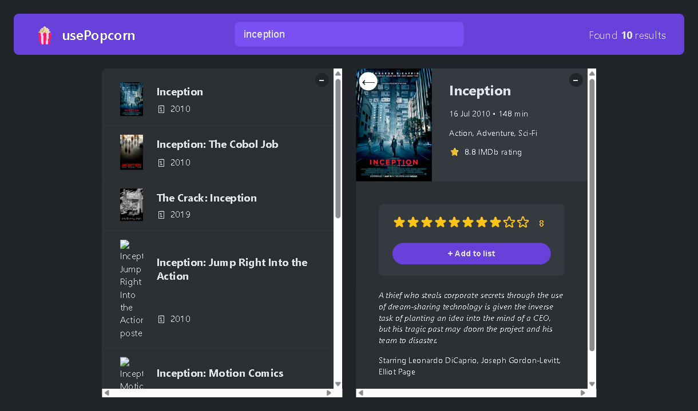

# usePopcorn

Search movies from the OMDb API, rate the ones you have seen, and keep a list
with your average rating and total watch time.



This is the project where `useEffect` finally made sense to me. Not the "run
some code after render" part — the cleanup part, and why it exists.

## Running it

You need your own OMDb key, it is free:

```bash
npm install
cp .env.example .env.local   # then put your key in it
npm start
```

Get the key here: https://www.omdbapi.com/apikey.aspx

## The three effects, and why each one cleans up

**Search.** Every letter you type fires a request. Type "inception" and you
have nine requests racing each other. Whichever one answers last wins, and
that is not necessarily the one for what is now in the box.

So the effect creates an `AbortController`, passes its signal to `fetch`, and
cancels the previous request in the cleanup:

```js
const controller = new AbortController();

// ...fetch with { signal: controller.signal }

return function () {
  controller.abort();
};
```

Aborting makes `fetch` reject, which lands in `catch` — but that rejection is
me cancelling on purpose, not a real failure, so it is filtered out:

```js
if (err.name !== "AbortError") setError(err.message);
```

**Document title.** Opening a movie writes its name into the browser tab. The
cleanup puts `usePopcorn` back, so closing the details does not leave a stale
title behind.

**Escape key.** The details pane listens on `document` for Escape. Without
removing the listener on cleanup, every movie you open stacks another one, and
after browsing ten movies a single Escape press fires ten handlers.

All three are the same lesson: an effect that reaches outside React has to be
able to undo itself.

## Other things worth pointing out

- **The runtime has to be parsed.** OMDb sends `"148 min"` as a string. Adding
  that straight to state made the average come out as `"148 min169 min"`, so
  the number is split off before it is stored.
- **The API key is in `.env.local`, not the code.** `.env.local` is gitignored;
  `.env.example` shows the shape without the value.
- **State lives in `App`.** `watched` is needed by the summary, the list, and
  the details pane (to show "you already rated this"), so it sits in the
  closest common parent and comes down as props.
- **`Box` uses `children`.** Both panels are the same collapsible box with
  different contents, so the box knows nothing about what is inside it.

## Bugs I fixed after first writing it

Leaving these here because they were the useful part:

- `const [Error, setError] = useState("")` shadowed the built-in `Error`, so
  `throw new Error(...)` inside the same scope threw a `TypeError` instead of
  the message I wanted. Renamed to `error`.
- `MovieDetails` accepted `onAddWatched` but never called it, so the star
  rating did nothing and nothing could be added to the list. Wired up.
- The details request used `http://`, which gets blocked as mixed content once
  the app is served over HTTPS.
- `alt={`Poster of ${movie} movie`}` interpolated the whole object and rendered
  `[object Object]`.
- `StarRating` had `strokeWidth="{2}"` — the braces were inside the string, so
  the empty stars were drawn with the wrong stroke.
- `prop-types` was imported but never listed in `package.json`. It happened to
  work locally because something else pulled it in.
- `index.js` rendered a stray `<StarRating />` outside the app, with no
  `onSetRating` prop. Clicking a star there crashed.

## Not done yet

- The watched list is lost on refresh. It should go into `localStorage`,
  probably behind a `useLocalStorageState` hook.
- The fetch logic in `App` is long enough that it wants to be a `useMovies`
  hook.
- No tests.

## Built with

Create React App, React 19, the OMDb API.
